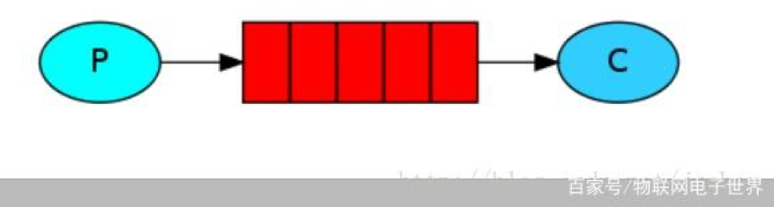
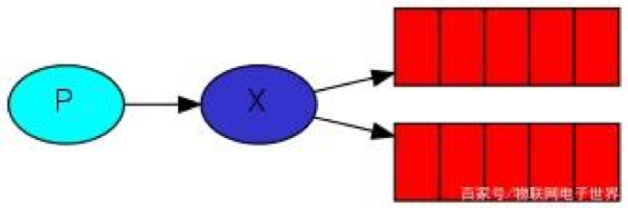
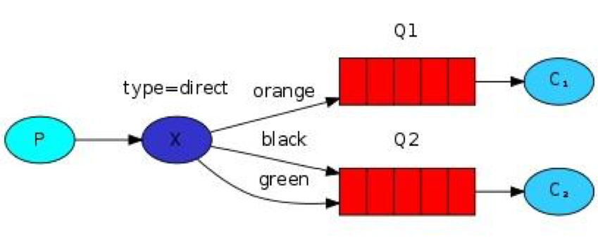
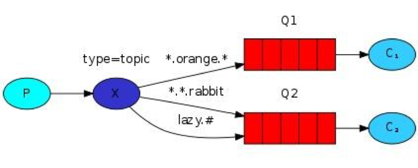
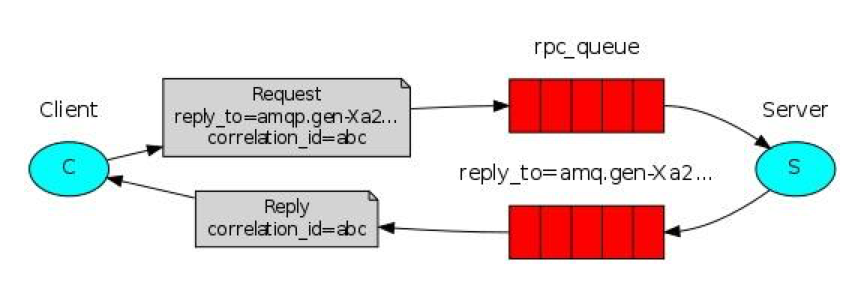

队列是一种特殊的线性表，特殊之处在于它只允许在表的前端（front）进行删除操作，而在表的后端（rear）进行插入操作，和栈一样，队列是一种操作受限制的线性表。进行插入操作的端称为队尾，进行删除操作的端称为队头。

一、什么是消息队列？
--- 
消息队列，用于存储还未被消费者消费的消息； 

## 常见的6种RabbitMQ队列：

1. 简单队列模式：最简单的工作队列，其中一个消息生产者，一个消息消费者，一个队列。也称为点对点模式

2. 竞争消费者模式：一个消息生产者，一个交换器，一个消息队列，多个消费者。同样也称为点对点模式

多个消费端消费同一个队列中的消息，队列采用轮询的方式将消息是平均发送给消费者；
特点：

1. 一条消息只会被一个消费端接收；

2. 队列采用轮询的方式将消息是平均发送给消费者的；

3. 消费者在处理完某条消息后，才会收到下一条消息

3. 发布/订阅模式：无选择接收消息，一个消息生产者，一个交换器，多个消息队列，多个消费者。称为发布/订阅模式

4. Routing模式：在发布/订阅模式的基础上，有选择的接收消息，也就是通过routing进行匹配条件是否满足接收消息。

5. 主题模式：同样是在发布/订阅模式的基础上，根据主题匹配进行筛选是否接收消息，比第四类更灵活。

6. RPC模式：与上面其他5种所不同之处，此类模式是拥有请求/回复的。也就是有响应的，上面5种都没有。

二、RabbitMQ存储和队列结构
---
### 存储原理：
首选确认一个点：持久化和非持久化的消息都会落地磁盘，区别在于持久化的消息一定会写入磁盘（可以在内存中也有一份），而非持久化的消息只有在内存吃紧的状态下落地磁盘，两类消息的落盘都是在rabbitMq的持久层中完成的

rabbitMq持久层包含两部分：队列索引和消息存储

队列索引（rabbit_queue_index）:负责维护队列落地磁盘的信息，包括消息的存储地点，是否已被交付给消费者，是否已被消费者ack，每个队列都有个与之对应的一个rabbit_queue_index。

消息存储（rabbit_msg_store）：以键值对的形式存储消息，它被所有的vhost中的队列共享，在每个vhost中有且只有一个，具体.rabbit_msg_store分两个：msg_store_persistent和msg_store_transient
msg_store_persistent:负责持久化消息的持久化，重启后消息不会消失.
msg_store_transient：负责非持久化消息的持久化。重新后消息会消失

