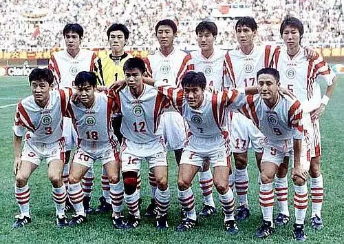
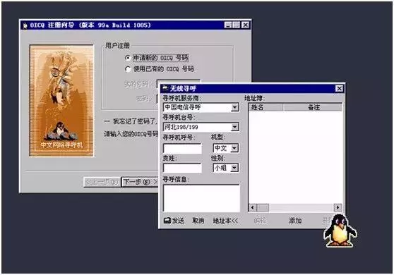

## ———— / BEGIN / ————

##### 作者：Hiro，微信公众号：宏观互联网 


1995年8月初，清华学生ace用台湾大学椰林风情站的系统，在实验室的一台386/Linux上架设了BBS。


8月8日，中国教育网第一个BBS“水木清华”正式开放，IP：166.111.1.11。


在这里，一个北京的小程序员，通过IP字段发现了同样在方正工作的暗恋对象；生活中羞涩的他在网络里却是如鱼得水，和女神天南海北聊得异常投缘，最终抱得美人归。


这就是周鸿祎和爱人胡欢在BBS上发生的故事。这篇中国社交二十年，便打算从这里说起：

### BBS---社交媒体的蛮荒时代

1994年，中国大陆第一个互联网BBS——曙光站上线；


1995年，马化腾在家搭建了慧多网深圳站点，起名Pony-soft；


1996年，求伯君在珠海架设了“西线”BBS站，雷军在北京架设了“西点”；同年，丁磊加入广州飞捷，架设了基于公网的BBS，并在上面认识了周卓林；汪延和李嵩波加入四通利方，利方在线成立，并先后开辟了“谈天说地”和“体育沙龙”版块。


彼时的BBS尚未普及，Telnet协议下的界面简陋、操作繁琐，但敏锐的嗅觉和对网络的渴望，让那些后来在互联网时代声名在外的大佬们纷纷聚集在这里，开拓了中国网络社交的蛮荒时代。


1997年，国足第六次冲击世界杯失败，最有希望的一届国家队折戟在通往法兰西的路上，无数球迷失望收场。


几天后，痴迷足球的福州男人老榕，在四通利方的体育沙龙上义愤填膺地写下了那篇让所有球迷落泪的文章：《大连金州不相信眼泪》。




这篇帖子随后传遍全网，引起足球界和媒体界的广泛关注，并被《南方周末》于1997年11月14日整版转载，四通利方连同论坛版主的名字“Gooooooal”第一次登上报纸。


——他就是后来新浪网的第一位编辑：陈彤。


这篇文章让人们第一次感受到互联网空前的传播效应，十强赛、老榕、四通利方，这几个毫无关联的词语，却在1997年成为了中国网络论坛兴起的标志。


这一年，丁磊了创办网易。


同年10月26日，一位刚刚过完生日的长沙青年在网易上挂了个论坛，功能很简单：一个TV Game资料的信息库，和一个TV Game同好灌水撒野的聊天室。


这位长沙青年本名田哲，沉默寡言不善交际，除了上网和电视游戏外别无爱好。


他给自己取了个网名，叫Mop，意为“拖把”。


这个网名直接催生了“猫扑”这一后来在网络世界影响深远的词汇。


1998年春天，毕业于南京动力交通学校计算机系的宅男刘琥，利用业余时间在家搭建了西祠胡同的原型，并于4月14日正式发布，华语地区第一个大型综合社区上线。


刘琥选择“响马”作为自己的网名，意为“拦路抢劫的强盗”，但在现实里，身为大学老师的响马为了维护西祠的服务器，却不得不过着吃泡面的穷苦生活。


他绝不会想到日后西祠会跨越地域，成为中文网络的一杆旗帜。


同年12月1日，四通利方与美国华渊合并，取名新浪。


而在海口，中山大学中文系毕业的邢明已经是股神级的人物，他有个很特别的网名“968”。


这一年，968决定把自己在股市中挣到的钱，投入到网络论坛这个未知的行业中。


1999年3月1日，天涯上线。


也许是创始人骨子里的文人气息，天涯吸引了大批网络写手，流传出《武林外传》、《明朝那些事》等畅销作品。


那时候的天涯文化，几乎就等同于网络文化；天涯也迅速站上了网络社区的鄙视链顶端。


从此，“网民”成为了一个新兴群体、网络用语开始流传在大街小巷。


今天我们耳熟能详的灌水、潜水、隔壁、菜鸟，以及早被扫进故纸堆的GG、PLMM、恐龙，都是那个时代的产物。


那时候，大家都一门心思扑在眼花缭乱的论坛内容和网恋上。968有一句名言：没网恋过的人没有网感。

###  IM---腾讯QQ的封神之路

花开两朵，各表一枝。


随着互联网的崛起，以猫扑、天涯为代表的BBS逐渐开花结果，进而发展出了新浪、搜狐、网易三大门户网站。


而另一边，远在深圳的Pony站长，即将带着他初生的QQ，走上中国社交的封神之路。


不知现在还有多少人记得QQ的原名：OICQ，即Open ICQ。


1996年，三个刚刚服完兵役的以色列青年发布了一款支持网络聊天的软件，起名ICQ——意为I SEEK YOU。


不到一年时间，ICQ就成为世界上用户量最大的即时通信软件，并于1998年底被美国在线以4.07亿美元收购。


此时，ICQ的用户数已经超过1000万。


目光回到中国，润迅的一名员工很早就注意到了ICQ这款软件，他就是慧多网深圳站的马站长。


当时马化腾已经萌生了创业的想法，曾经的慧多网网友、如今的网易创始人丁磊，通过开发邮箱系统成了小有名气的百万富翁，这给了他最直接的刺激。


不过他并没有想做类似ICQ的软件——因为彼时已有PICQ和网际精灵等效仿者。


创业的冲动不断地催促着年轻气盛的Pony马，终于，按捺不住的他找到老同学张志东，说想要做一款“网络寻呼机”。


虽然从现在看，那绝对是个糟糕的产品；但为了这个创意，马化腾和张志东又先后找来了许晨晔、陈一丹和曾李青。


自此，腾讯五虎集结完毕。


现在，神话的诞生只差一个契机了。


很快，一次偶然的机会到来。广州电信公开向全社会招标类似ICQ的中文即时通信工具，马化腾五人决定试试看。


由于时间紧迫，只来得及出了一个技术方案，它就是OICQ。


可惜，那次的中标者早已内定了飞华公司旗下的PCICQ。


尽管如此，执着的马化腾依然决定把OICQ做出来——这大概就是冥冥之中自有天意吧。


1998年11月11日，腾讯公司注册成立，马化腾的“腾”，即时通讯的“讯”。


1999年2月10日，OICQ正式发布，版本号99beta build 0210。



说起来好笑，当时腾讯的目标是：第一年发展1000个用户，第二年争取3000~4000个，第三年达到1万个。


然而，出乎所有人的预料，仅仅9个月后OICQ的注册用户便突破了100万。


可惜现实是残酷的：腾讯的收入根本养不起这个“滴滴”叫的小精灵。


由此引出的团队到处接活挣钱补贴家用、全体员工工资减半、开价300万出售腾讯、生死线上拿到IDG投资，又是另一个紧张的故事，在这里就不详细展开了。


时间来到2000年，OICQ席卷中国的同时，一纸诉状发到了刚刚成立3年的腾讯公司：ICQ的母公司美国在线起诉腾讯侵权，并要求收回OICQ.com和OICQ.net两个域名。


历史性的转折到来了，OICQ必须改名。


但是，起个什么名字好呢？


这一度让腾讯苦恼异常。


在当时，由于网络聊天软件以ICQ和OICQ最为著名，因此这类软件在业内被亲切地称为“QQ”。


马化腾急中生智，决定将这个词据为己有。


2000年11月，QQ迭代历史上的经典版本QQ2000正式上线。


后来的事情大家都知道了，QQ的用户量很快突破1亿，在即时通讯这个领域一骑绝尘，后来微软的MSN大举来犯，也没能阻挡这只外表人畜无害的企鹅走上社交神坛。


至此，腾讯奠定了社交帝国的统治基础，在今后的日子里挟用户以战天下，可谓是神挡杀神，无坚不摧。

### Blog---自媒体的破晓黎明

跨入新世纪，席卷全球的互联网泡沫和资本寒冬，让许多后来知名的网络公司命悬一线。


但是，正如尼采说的：“杀不死我的，只会让我更强大。”互联网这个新物种，注定要在新的千年画下浓墨重彩的一笔。


幸运的腾讯拿到投资后改名换姓重获新生，接下来，中国的互联网也进入了野火烧不尽、春风吹又生的季节。


一方面，戴志康和他的Discuz给论坛的发展带来了革命性转折，各种地方论坛、软件论坛、小说论坛如雨后春笋般出现。


另一方面，Blog漂洋过海来到中国，自媒体的雏形即将诞生。

2002年7月6日，已经小有名气的专栏作家方兴东发布了两篇文章：《向微软投降》和《微软为什么》。


这两篇文章如往常一样被刊登在了各大网站的推荐栏目上，但令他惊讶的是，短短两个小时，所有文章遭到微软的强势封杀。


方兴东进入IT业以来，第一次在网络上失去话语权，这让他觉得可笑又可悲。


那一年，互联网开始回暖，搜狐率先宣布盈利。


也是在那一年，方兴东知道了Blog，机会叩开了这位博客教父的大门；他意识到，博客对于中国的互联网来说将是一次巨大的改变。


于是方兴东和王俊秀一起发表了《中国博客宣言》，第一次将Blog翻译成博客，并将其称之为信息时代的麦哲伦。在宣言的最后，方兴东写道：

```
 博客文化能引领中国向知识社会转型，博客关怀能开启一个负责的时代。
```

2002年8月，博客中国成立。


同年，中科大大二学生郭晓雷用200多元单枪匹马架起了Blogbus；在杭州读大三的季华开发了Blogcn，随后胡之光加入，“中国博客网”诞生。


可惜的是：博客教父预言的新时代没能到来，开放性差，使得博客始终没有进入大众的视野。


接下来，戏剧性的一个人登场了——她就是木子美。


2003年6月19日，一个名叫木子美的网络作家在博客中国创建了个人主页；8月某日，她在著名的《遗情书》中实名叙述了与广州著名摇滚乐手的“一夜情”故事。


该篇被网友转载到西祠胡同，引起轩然大波。


11月11日，三大门户网站分别在头版头条推荐了关于木子美的文章，博客中国访问人数瞬间突破十万。

方兴东自嘲说：

```
精英们知道博客是因为我，而大众们知道博客却是因为木子美。
```
2003年底，天涯博客试行版推出，成为国内第一个将公共社区与个人博客相结合的网站。


随后天涯陆续出现竹影青瞳、流氓燕等新的“木子美们”，博客就这样被印上了色情的胎记，以一种尴尬的方式流行起来。


两年后，新浪高调出手，于2005年9月8日推出Blog 2.0公测版，借助名人效应在博客领域进行“圈地运动”，短短两个月用户数量突破百万。


紧接着，腾讯、搜狐、网易等门户网站相继开火，门户博客全面爆发。


有了博客这支生力军的加入，论坛、社区和各类门户网站进一步发展，更多的新锐写手不断涌现，木子美逐渐被人遗忘，取而代之的是网络文学、新闻评论、知识分享，是更接近方兴东心目中的理想国。


自媒体的种子也在这段时间生根发芽。


而随着宽带入户，互联网也逐渐走进了平常百姓的生活。


2003年12月3日，贴吧正式上线，成为了百度在社交领域的拳头产品；


2005年3月6日，阿北创立豆瓣，全网文青们找到了自己的精神角落。


中国互联网全面进入Web2.0时代。

### SNS---熟人社交全面爆发

web2.0时代以来，人们很快遇到了一个尴尬的局面：


一方面，互联网的内容生产几乎没有门槛，但缺乏内容的梳理和传播机制，大量信息被淹没；


另一方面，互联网连接的人越来越多，但主流网站都以内容为中心，熟人关系在网络中的渗透遇到了阻碍。


此时的大洋彼岸，以六度空间理论为基础的社会化网络SNS，正在Friendster和Myspace的带领下发展的如日中天，哈佛校园也即将迎来Facebook的诞生。


在这样的背景下，另一个对创业充满强烈好奇的大男孩登场了，他就是王兴。


2003年冬天，在美国读博的王兴决定回国创业。


他找来了两个人：清华保送中科院的本科室友王慧文，和计算机专业出身的中学同学赖斌强；三人一直都有朦胧的创业想法，王兴的回国成为了一个契机。


三个人就在清华附近的海丰园租了一套房子，开始第一个产品——社交网站“多多友”的开发。


也许是应了那句话：

```
天将降大任于斯人也，必先苦其心志劳其筋骨。
```

多多友上线后并没有收到好的反响，接下来的一年里，他们又陆续尝试了好几款产品，全部以失败告终。


值得庆幸的是：2004年在中国起步的SNS都发展得不太理想，意味着王兴还有机会。


2005年，一股反思SNS的思潮在网上弥漫开来：中国人保守，不愿意把照片和真实姓名等信息发布在网上，SNS可能不适合中国。


但王兴他们并不怀疑——因为1999年陈一舟的ChinaRen就是基于真实信息的社区网站，可惜ChinaRen在资本寒冬下卖给了搜狐，否则中国的Facebook也许早有定论了。


后来，在翻看多多友的数据时，王兴他们发现很多人会每周登陆一次，和朋友互相留个言、发个私信。


他们隐约觉得：问题不在于用户愿不愿意留下真实姓名，而在于网站有没有东西让用户觉得留下真实姓名是有价值的——那个东西就是熟人关系。


2005年12月8日，模仿Facebook的校内网正式上线。


校内网没有QQ那么幸运，早期的用户都是团队通过各种各样的方式拉来的，门票抽奖、大巴车接送火车站、赞助学生拍摄DV。


但和QQ一样的是，产品做对了。


校内网的用户慢慢达到了1千、1万，竞争对手也蜂拥而来。


北大的底片网、复旦的饱蠹、人大eDorm、北航的looface、中山大学的亿友，李肇星的儿子哈佛归来做了dorm99、耶鲁MBA的张帆夫妇做了占座网、陈一舟做了5Q网。


SNS一入校园，立刻像四溅的水花，爆发出和当年BBS一样的生命力。


和竞争者相比，校内网最大的特点就是使用了Facebook成熟的UI和交互。


虽然一度背上抄袭的骂名，但省时省力，而且比起其他网站的盲目创新来说，对用户也更加友好。


有趣的是：也正是因为抄袭Facebook，校内网才进入了红杉资本的视线。


可惜，彼时的王兴还是个稚嫩的大男孩，商业模式的缺失和一时的心高气傲，使得校内网最终与红衫失之交臂。


最后，校内网弹尽粮绝，面对激烈的市场竞争，不得已卖身给了陈一舟的千橡集团。


2006年，校内网与5Q网强强联合，最终成功占领了校园市场；通过熟人关系的突破，SNS终究还是在中国找到了出路。


但是俗话说，条条大路通罗马；另一边，开心网异军突起，通过白领圈走出了一条与众不同的道路。


2008年3月，定位在白领圈的开心网成立，并在随后的两个月内上线了朋友买卖和争车位应用，类似朋友圈小游戏的社交裂变模式第一次出现在SNS网站上。


短短一年时间，开心网的注册用户量就突破了1500万，直追校内网。


随着开心网平地而起，SNS开始走出校园，新浪朋友、搜狐白社会、淘宝淘江湖、阿里人脉通，一时间各路资源争先恐后地杀入这个赛道。


2009年8月4日，近7000万注册用户的校内网，正式更名为大家所熟知的人人网，标志着中国的SNS网络进入鼎盛时期。


用关系链作为过滤机制，用feed流进行内容分发，人们的上网体验终于自博客时代以来又上了一个台阶。


加上API接入的社交游戏等第三方应用，属于Facebook的胜利似乎已经近在眼前了。


然而，人人网们想要成为Facebook，还有最后一战要打——横亘在他们面前的是一条巨大的天堑，对面站着的是那只带着红围巾的憨厚企鹅，和它身后的腾讯帝国。


早在2005年4月，腾讯就推出了另一款社交产品——QQ空间。


彼时的QQ空间还是一个blog气息浓厚的QQ附属品，但严格说来，这个企鹅家族的新成员身上，已然带着前所未有的SNS基因。


它静静地蛰伏着，等待着一鸣惊人的出场。


2009年1月，QQ校友上线，腾讯以防御人人网的姿态向SNS迈出了试探性的一步；同年11月，腾讯买下qzone.com域名，QQ空间正式开启由个人主页向SNS网络的转型。


只是原以为会惊心动魄的战役，却打得毫无悬念。


短短几个月内，QQ农场等空间应用迅速杀死开心网，QQ校友也在用户体量上压制人人网，SNS之战以令人咋舌的速度收官。


——而这一切都要归功于QQ庞大的关系网络；在这只企鹅面前，人人网只能俯首称臣。


2010年四季度，QQ空间用户超过4.8亿；2013年末，QQ空间被列为世界第三，中国第一的社交网站。


中国为什么出不了Facebook？


因为有QQ，这几乎成为了后来互联网人的共识。


SNS大战看似草率的收尾，让腾讯再一次稳固了自己社交帝国的统治地位。


但是，战争还远未结束，屹立不倒的腾讯帝国将继续迎接挑战，这一次，胜利却属于别人。


### 微博---网络传播的社会化时代

我们先把时间倒回2007年春天，在这篇社交二十年里，那个叫王兴的大男孩还有属于他的第二次出场。


校内网加入千橡集团后，王兴等人并不是那么如意，王慧文、赖斌强等人纷纷出走，王兴也在度过锁定期后离开了千橡。


这一次，王兴找来在百度工作的学弟穆荣均，说他打算重新做一件事，绝不是为了某一天再把它卖掉。


王兴和穆荣均就这样开始了第二阶段的创业，他们将目光瞄向了Twitter。


上线半年多的Twitter是一种微博客，用户可以通过电脑、手机在上面发送限制在140个字符以内的消息。


2007年3月，Twitter在美国得克萨斯州举办的“西南偏南”活动上一炮而红，每天发送的消息量达到了六万条。


在王兴眼里，Twitter这种轻便的模式，可能会重新定义互联网传播信息的方式。


2007年5月，饭否网上线。


经过这些年的创业，王兴在业内已经有了一定的影响力，也认识了很多朋友，这些人都成了饭否的首批用户。


同时，秉着自由、开放的精神，饭否网也赢得了一些博主和互联网深度用户的青睐。


不过早期大家都不知道140字写点啥好，虽然SNS已经步入正轨，但用户的分享习惯还没有完全培养起来。


就互联网的大环境和手机的功能来说，2007年的饭否网在国内算是比较超前的，以至于后来王兴他们转而做了一款面向白领的SNS网站“海内网”。


当然，由于种种原因，海内网并没有像开心网那样进入SNS的第一梯队，而在忙碌海内网的一年里，饭否却悄然生长起来。


2008年，Twitter的热潮传到了中国，这种微博客的形态满足了用户随时随地进行记录和分享的需求，也比传统门户网站有着更直接的新闻获取和传播能力。


饭否继承了这种发璞归真的简单交互，在接下来的一年里，爆发出了旺盛的生命力。


2009年，饭否网用户突破100万，越来越多的新闻从饭否上传播开来，例如湖北巴东邓玉娇事件、石首事件等，饭否开始有了社会舆论平台的雏形。


这也给饭否带来巨大的压力——按照法律监管的要求，王兴他们不得不删掉很多敏感词。


令人惋惜的是：不懂政治的王兴依然小觑了舆论的威力。


下半年，乌鲁木齐事件爆发，饭否则迎来了长达505天的关停。


王兴在社交领域的出演就此告一段落，接下来美团网的征程，又是另一个波澜壮阔的篇章。


值得庆幸的是：在饭否停滞的一年多里，只有两个员工离开团队，其中一人便是张一鸣，而未来被新浪微博视为眼中钉肉中刺的今日头条，也都是后话了。


饭否虽然被和谐了，但微博这种短平快的模式却已经深入人心；2009年9月，新浪微博悄然上线，成为第一家开放微博服务的门户网站，并且再一次复制博客时代的名人策略，以令人吃惊的速度吸引了全网的注意力。


随后，各类门户网站微博、电子商务微博、SNS微博纷纷成立，连电视台、电信运营商也开始涉足微博业务，中国真正进入微博时代。


与此同时，远在硅谷的乔布斯一年之内发布了iPad和iPhone 4两款产品，21世纪刚过10年，移动互联网突然到来了。


随着智能手机的普及，具有天然移动属性的微博进入空前鼎盛的时期，其中新浪微博一马当先，在经历了大浪淘沙之后，迅速成为了国民性的现象级产品。


李开复以自己的开博经历出版了一本书，书名为《微博，改变一切》，并认为：
```
因为有微博，网络传播的社会化时代已经到来！
```

可惜这一次，腾讯似乎慢了一拍。


腾讯微博上线于2010年5月，比新浪微博整整晚了8个月。


社交网络天生具有赢家通吃的特点，8个月的时间，已经足够曹国伟和陈彤确立新浪微博的统治地位了。


接下来的一年，也许是马化腾最痛苦的一年。


腾讯微博焦头烂额地追赶新浪，不料一篇《狗日的腾讯》让腾讯陷入内忧外患、腹背受敌的境地，著名的3Q大战也就此拉开序幕。


2010年底，在和360大战打得头破血流之际，新浪微博宣布用户量达到1亿，并推出了具备通讯与媒体传播双重功能的新浪微群，直接向QQ群发起挑战。


正如打败QQ的，绝不会是另一个QQ；打败微博的，也绝不会是另一个微博。


几乎所有人都意识到：腾讯对新浪的胜率十分渺茫。


社交帝国的未来一时间显得黯淡无光。


然而，谁也不会想到3Q大战竟是PC时代的血色绝响，在辽阔的互联网世界里，一个新的时代即将到来，微博战场的失利，也没能影响腾讯的再次涅槃。

### 微信---移动互联网的到来

2010年10月，一款名为“kik”的应用登陆App Store和Android Market，短短15天内就有超过100万人注册下载。


这款通讯工具的登场，像极了当年的ICQ。


在这个领域，反应最快的是曾经的“西点站”站长——雷军。


在经过金山的洗礼后，雷军已经是中国互联网界的传奇人物之一。


他认为，摆在眼前的很可能是占领移动互联网领域的极佳切入点。


短短37天后，小米发布了中国第一款模仿kik的产品——米聊。

```
如果腾讯介入这个领域，那米聊成功的可能性就会大大降低，据内部消息，腾讯给了我们3个月的时间。
```


在米聊发布后的一次聚餐中，雷军如是说。


彼时的腾讯深陷3Q大战的泥潭不能自拔，“一直在模仿，从来不创新”的指责直接挑战了腾讯的产品信仰，对“弱连接社交”这样战略性平台的误判更是导致微博战场的全面溃败。


而米聊的出现，则很可能是腾讯离死亡最近的一次。


现在，轮到那个被称为神的男人出场了。


1996年，网易开发的WebMail，让丁磊成为互联网产业里第一个赚到真金白银的创业者，同时直接刺激了马化腾的创业梦想。


而几乎同一时间，一位毕业不到两年的研究生，独立编写了知名的邮件客户端Foxmail，他就是张小龙。


当时中国的联网速度慢，客户端反而比较快，Foxmail上线一年，中文版的使用人数就超过了400万，英文版的用户更是遍布20多个国家；张小龙因此成为华南地区的传奇，被视为继求伯君之后的第二代软件工程师的代表。


那时马化腾还在经营深圳站点，他曾给张小龙写过一封邮件，指出了Foxmail的一个设计错误，这便是pony站长与微信之父的第一次交流。


但与丁磊和马化腾不同的是：生性内向的他对商业并不感冒，因此一直没有成立自己的公司。


1998年，Foxmail作价1200万卖身博大，张小龙辗转做了企业邮箱服务器；


2005年，Foxmail在QQ防御MSN的战役中被腾讯收购，张小龙因此进入了QQ邮箱；但由于邮箱的盈利模式模糊不清，他的职业生涯依然不温不火。


2010年11月，在广州离群索居的张小龙注意到了kik，并在一个深夜发邮件给马化腾，建议由他的团队做一个类似的产品。


这对他和腾讯而言，无疑是值得庆幸的——因为如果没有这个决定，少年成名的张小龙，或许便从此泯然众人，而腾讯也将彻底与移动时代失之交臂。


于是，2010年11月20日，在工信部官方调停3Q大战的当天，“微信”项目正式启动，次年1月21日，微信上线。


从时间上来看，腾讯最终只给雷军留了40天。


接下来，便是米聊与微信的生死时速。


一开始，米聊和微信都表现平平——因为在国内，中国的电信运营商提供了丰富的短信套餐，和kik一样以省短信费为卖点，并没能成功突围；同时，微信在1.2版本中提供了图片分享功能，然而反响也不热烈。


不过总体来说，米聊团队表现出了极强的战斗力，稳稳保持着先发优势。此时，香港的一款同类产品Talkbox，以语音对讲机为卖点，已经获得了三四百万用户。


2011年4月，米聊借鉴Talkbox，率先推出对讲机功能；5月，微信迅速跟进，终于，用户量迎来了井喷。


经过了短时间的落后，张小龙和他的微信开始狂奔，“摇一摇”和“漂流瓶”相继上线，虽然争议不断，却推动了用户的增长。


而没有打过大型社交战役的米聊团队，基础性能的薄弱开始暴露出来：用户量的激增导致米聊服务器频频宕机，甚至会有某个地区的米聊用户集体掉线的事情发生——胜利的天平开始倒向微信。


7月，张小龙团队打出决定性的一击。


“附近的人”功能正式上线，微信的日新增用户在没有QQ资源的前提下达到了惊人的10万，从此战局彻底扭转。


11月，马化腾干脆停止了将在北京、上海投放的微信户外广告——微信在与米聊的战争中宣告胜利。


很快，雷军退出了与微信的竞争，全身心投入硬件的开发。


此后，来自丁磊的易信、中国移动的飞聊、马云的来往，都只对微信造成了极其微弱的抵抗。


2012年3月29日凌晨4点，微信用户突破1亿，历时433天。


这几乎是互联网历史上的一个奇迹：QQ在线用户数突破1亿用了将近10年，Facebook用了5年半，Twitter用了4年。


这场战役，以微信的胜利告终；同时，微博的战争也已经没有继续的必要了。


2012年4月19日，朋友圈上线，微信完成了通信工具向社交平台的升级，基于手机的熟人社交圈正式出现，微博、人人遭到沉重打击；


8月23日，公众平台上线，一个全新的舆论生态在微信上出现，此后纸媒开始雪崩式倒塌；


2014年春节，微信红包上线，微信支付用户数量直逼支付宝，腾讯通往电商的最后一块壁垒被击碎。


短短三年，张小龙几乎再造了一个腾讯。


微信的成功，不仅延续了社交帝国的繁荣，更激起了腾讯一个极大的野心：微信有可能成为移动时代新的桌面系统，完成一个闭环的社交和商业生态链。


而小程序的诞生，便很可能是这个生态链的最后一块拼图。


马化腾曾说，微信是腾讯拿到的移动互联网“站台票”，现在看来，微信早已成为移动互联网的收费站。

### 重新起航---百花齐放的新篇章

微信从QQ手中接过帝国的荣耀，但社交创业的浪潮却远还没有结束，移动社交从此进入寡头统治的战国时代。


一方面，在移动大战中失语的手机QQ率先变革，深耕娱乐化、场景化社交，受到年轻人的追捧；同样主打“附近的人”，陌陌从微信手里接过“XX神器”的标签，做成了又一个上市公司；阿里的来往团队苦心修炼，开发了办公领域的钉钉；还有语音的YY、职场的脉脉、直播的映客……


另一方面，陌生人社交领域催生出更多细分市场：有主打颜值的探探、主打心灵匹配的soul、主打同志交友的blued、主打情侣互动的恋爱记，以及最近被称为“社交新贵”的子弹短信、爱情银行和数不清的00后社交产品们，这篇作为历史回顾的篇章就不再一一细数了。


最后，未来的社交产品会是什么样子，未来的微信是否会被颠覆，我们不知道，但我们永远心怀期待。

#### 主要参考资料：


《腾讯传 1998-2016》，作者：吴晓波；

《九败一胜：美团创始人王兴创业十年》，作者：李志刚；

《互联网周刊》：网络论坛激荡的十年，作者：张瑜；

天涯十六年成长史，作者：Eric 樊耀；

方兴东：远去的博客江湖，作者：薛芳

##———— / END / ————

